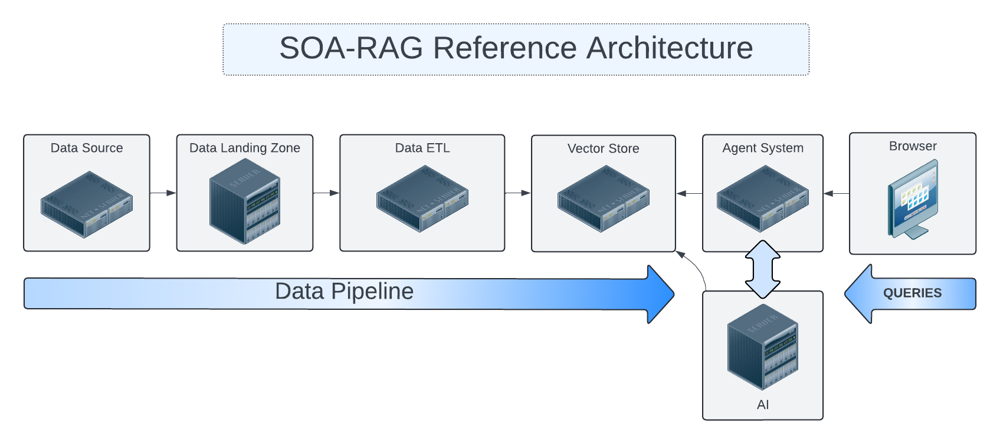
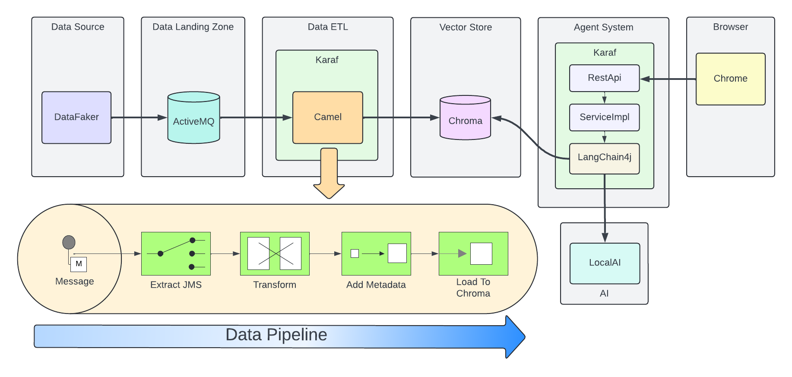
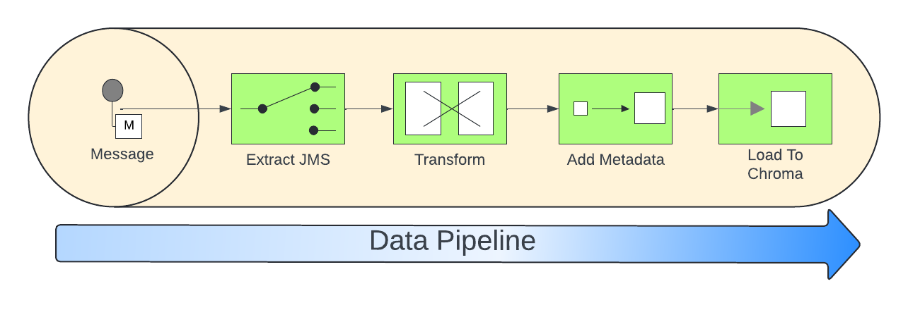
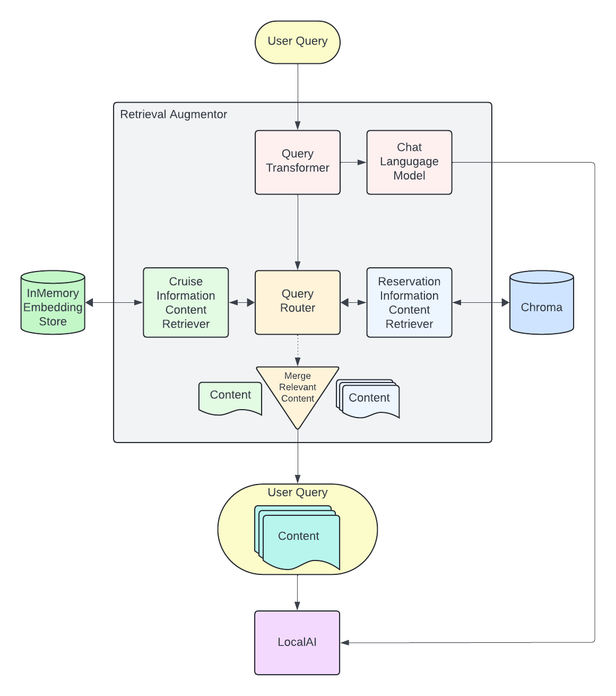
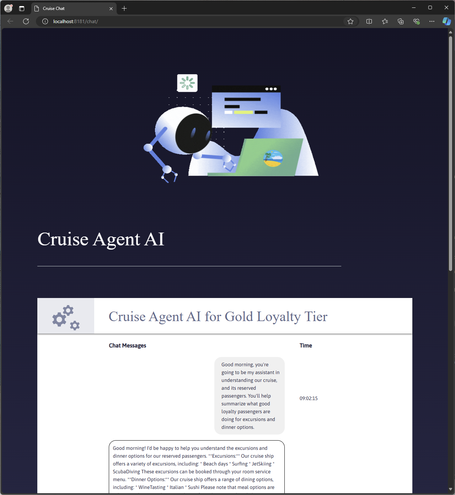
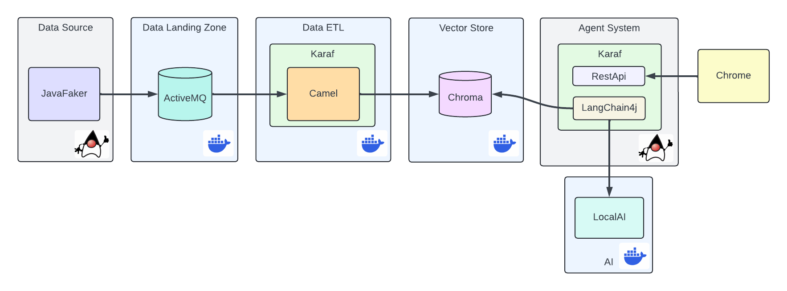

# SOA RAG Reference Architecture

In this post we’re going to explore a SOA RAG reference architecture.

<figure>

</figure>

We’ll start with high level design theory, then discuss an
implementation.

<figure>

</figure>

# High Level

One key to efficient Retrieval Augmented Generation is to pre-process
segment data and query embeddings before a user required to use them.

To achieve this an architect may design a data pipeline that contains
several stages.

Sample Data Pipeline:

Data Source → Data Landing Zone → ETL → Vector DataStore

Let’s discuss each of these stages.

## Data Source

Data sources from our point of view are anything that produces data that
our system consumes.

In our demo architecture we use DataFaker to produce inputs to our
pipeline.

Here is a sample message body sent to data landing zone:

``` json
{
  "firstName": "Claud",
  "lastName": "Sporer",
  "streetName": "Zemlak Tunnel",
  "streetAddress": "9843 Botsford Inlet",
  "zipcode": "18282",
  "email": "some.email@fake.email",
  "cell": "(555) 555-5555",
  "roomType": "balcony",
  "excursions": [
    {
      "1": "Beach",
      "2": "JetSki",
      "3": "Beach"
    }
  ],
  "mealOptions": [
    {
      "1": "Italian",
      "2": "Italian",
      "3": "WineTasting"
    }
  ]
}
```

## Data Landing Zone

When data is created and transmitted to our system, the collection of
endpoints, brokers, and other services which collect primary data live
here.

Examples: Apache ActiveMQ, Apache Kafka

In our demo architecture we use Apache ActiveMQ as a JMS data sink.

## ETL

Extract, Transform, Load is a design paradigm.

Incoming data is first extracted, then transformed into something we can
process, the data may be enriched, then sent (loaded) for further
processing or storage. In modern implementations business rules for
cleaning/filtering data may be augmented with Machine Learning to
improve data quality & apply metadata for improved reuse.

Examples: Apache Camel, Apache Flink

In our demo architecture we use Apache Camel to implement an ETL
pattern.

<figure>

</figure>

Here we illustrate incoming JSON bodies are extracted from JMS queue,
Transformed into a format our system can use, Metadata enrichment
occurs, then we load this data into Chroma DB.

``` xml
<!-- Camel configuration -->
    <camelContext id="etl-camelContext" trace="false" xmlns="http://camel.apache.org/schema/blueprint" >

        <!-- Accept the order -->
        <route id="ETL">
            <!-- Take message off broker queue, pass json body to camel pipeline -->
            <from id="Extract" uri="jmsConsumer:queue:reservations"/>
            <!-- Transform and add Metadata to embedding document -->
            <process id="Transform" ref="TransformProcessor"/>
            <!-- Load into Chroma -->
            <process id="Load" ref="LoadChromaProcessor"/>
        </route>

    </camelContext>
```

Our ETL Camel route is wired in Blueprint XML.

``` java
@Override
public void process(Exchange exchange) throws Exception {
    String body = exchange.getIn().getBody(String.class);
    //Use body and data sources to generate metadata for this embedding.
    Metadata metadata = new Metadata();
    metadata.put("tenant", "savoir");
    metadata.put("chargeBacks", String.valueOf(chanceOf(2)));
    metadata.put("altercations", String.valueOf(chanceOf(2)));
    metadata.put("casinoUsed", String.valueOf(chanceOf(50)));
    metadata.put("loyaltyLevel", randomLoyaltyLevel());
    TextSegment textSegment = TextSegment.from(body, metadata);
    exchange.getIn().setBody(textSegment);
}
```

Above, our Transform Camel Processor handles making TextSegments.
LangChain4j provides a Metadata structure which we append to our
TextSegments.

``` java
@Override
public void process(Exchange exchange) throws Exception {
    TextSegment textSegment = exchange.getIn().getBody(TextSegment.class);
    EmbeddingModel embeddingModel = new OSGiSafeBgeSmallEnV15QuantizedEmbeddingModel();
    Embedding embedding = embeddingModel.embed(textSegment).content();
    chromaDataStore.add(embedding, textSegment);
}
```

Our Chroma DB loading Camel Processor performs an add action upon our
datastore.

## Vector Database

In generative AI settings a Vector Database acts as the memory for
running agents.

Embeddings are efficiently indexed in a way to increase performance,
accuracy, and relevance of data & query processed by the LLM.

Examples: Chroma, Pinecone

In our demo architecture we use Chroma.

## Agent System

The Agent System is where our interaction with our application, the
Vector Datastore & the LLM occur.

We use Apache Karaf with a Backend-For-Frontend design to provide a web
interface, and integration to LocalAI via LangChain4j.

<figure>

</figure>

When a user question is posted to the system we enter the Retrieval
Augmentation workflow.

``` java
QueryTransformer queryTransformer = new CompressingQueryTransformer(chatLanguageModel);
```

The Query is processed by a Query Transformer, in our demo we use
Compression to allow the LLM to compress a given query and previous
conversation into a single query. There are other transformer options
one may use here such as Query Expansion, Query re-writing, Step-back
prompting, and Hypothetical document embeddings (HyDE).

``` java
ContentRetriever cruiseInformationRetriever = EmbeddingStoreContentRetriever.builder()
                .embeddingStore(cruiseInformationStore)
                .embeddingModel(embeddingModel)
                .maxResults(2)
                .minScore(0.6)
                .build();

        Filter cruiseFilter = metadataKey("loyaltyLevel").isEqualTo("gold");

        ContentRetriever reservationInformationRetriever = EmbeddingStoreContentRetriever.builder()
                .embeddingStore(reservationInformationStore)
                .embeddingModel(embeddingModel)
                .filter(cruiseFilter)
                .displayName("default")
                .build();
```

We build Embedding Content Retrievers for our base Cruise Information,
and our Customer Reservation store. In the case of our reservations, we
filter by a metadata key for loyalty level equal to gold. This greatly
reduces the amount of data the LLM may need to consider.

``` java
QueryRouter queryRouter = new DefaultQueryRouter(cruiseInformationRetriever, reservationInformationRetriever);
```

We plug our Information Retrievers into a Query Router. The router will
determine which sets of content should be considered by our LLM.

``` java
RetrievalAugmentor retrievalAugmentor = DefaultRetrievalAugmentor.builder()
                .queryTransformer(queryTransformer)
                .queryRouter(queryRouter)
                .build();
```

Now we plug all of the above into our Retrieval Augmentor.

``` java
return AiServices.builder(CruiseAssistant.class)
            .chatLanguageModel(chatLanguageModel)
            .retrievalAugmentor(retrievalAugmentor)
            .chatMemory(MessageWindowChatMemory.withMaxMessages(10))
            .build();
```

Finally, we connect our Retrieval Augmentor and Chat Language Model to
become avaialble to process requests.

# The Result

Once this pipeline is created, an agent may use the pre-populated
embedding stores for the LLM.

<figure>

</figure>

In the screen capture above, we can see our simple Agent UI chat
functionality. Users post questions to the Agent, and the Agent replies.

# Demo

Now that we’ve covered the high level design, lets build our demo
implementation and deploy it. We’ve taken care to curate several of the
components as Dockers. Leaving the initial data generation as a small
Java tool we can execute from the command line, and our Agent system -
which we’d like to dive deep into.

<figure>

</figure>

The scenario we’re modeling is a Cruise line processing passenger
information with respect to an upcoming cruise.

Our Cruise Agent AI will allow the Cruise operator to get a 'feel' for
their operational needs beyond the base logistics of providing food,
entertainment, and accommodations. The user may prime the AI Assistant
with a prompt; we could do this in code however for flexibility of the
demo we pass this along to the user.

Build our demo project:

``` bash
cd agentSystem
mvn clean install
```

To setup ETL as a Dockerized Container:

``` bash
cd ETLDocker/target
docker build -t etl .
```

Start supporting services:

``` bash
cd docker
docker compose up
```

You may want to grab a cup of coffee while docker handles downloads, and
service initializations.

When the Message Broker is running, you may populate the reservations
queue using the provided dataSource script.

Script build and run instructions:

``` bash
cd dataSource
mvn clean install
java -cp target/dataSource-1.0.0-SNAPSHOT.jar com.savoir.soa.rag.ref.arch.data.faker.Publisher
```

Setup Apache Karaf 4.4.6, and start the process to access Karaf’s
console.

We use the following console commands to setup the Agent system:

``` bash
feature:repo-add mvn:com.savoir.soa.rag.ref.arch/AppFeature/1.0.0-SNAPSHOT/xml/features
feature:install agent
feature:install war
install -s webbundle:mvn:com.savoir.soa.rag.ref.arch/AppWar/${project.version}/war?Web-ContextPath=chat
```

Manual Testing Endpoints:

``` bash
curl --location --request POST 'http://127.0.0.1:8181/cxf/ai/ask' \
--header 'Content-Type: text/plain' --header 'Accept: text/plain' -d 'test'
```

# Conclusion

# About the Authors

[Jamie
Goodyear](https://github.com/savoirtech/blogs/blob/main/authors/JamieGoodyear.md)

# Reaching Out

Please do not hesitate to reach out with questions and comments, here on
the Blog, or through the Savoir Technologies website at
<https://www.savoirtech.com>.

# With Thanks

Thank you to the JavaFaker, Apache ActiveMQ, Apache Camel, Apache Karaf,
Apache CXF, LangChain4j, and LocalAI communities.

\(c\) 2024 Savoir Technologies
